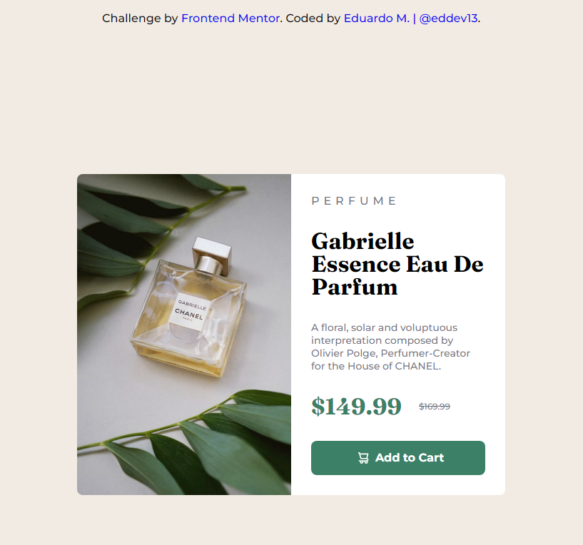
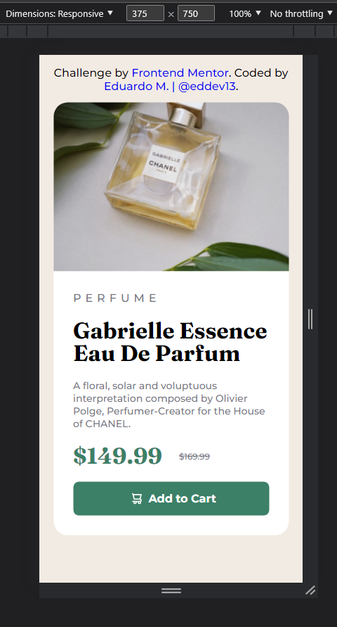
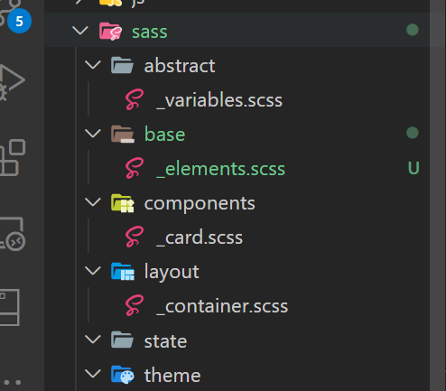

# Frontend Mentor - Product preview card component solution

This is a solution to the [Product preview card component challenge on Frontend Mentor](https://www.frontendmentor.io/challenges/product-preview-card-component-GO7UmttRfa). Frontend Mentor challenges help you improve your coding skills by building realistic projects. 

## Table of contents

- [Overview](#overview)
  - [The challenge](#the-challenge)
  - [Screenshot](#screenshot)
  - [Links](#links)
- [Author](#author)
## Overview

### The challenge

Users should be able to:

- View the optimal layout depending on their device's screen size
- See hover and focus states for interactive elements

### Screenshot




### Links

- Solution URL: [card-preview](https://eddev.com.br/projects/product-preview-card-component/)

## My process

### Built with

- Semantic HTML5 markupS
- CSS3
- Flexbox

### What I learned

Development with SASS pre-processor and SMACSS architecture.

&nbsp;



&nbsp;

Namespaces and BEM method.

```html
<section class="l-container">
    <div class="c-card">
      <div class="c-card__image"></div>
      <div class="c-card__info">
        <a href="./" class="c-card__category">perfume</a>
        <h2 class="c-card__heading">
          Gabrielle Essence Eau De Parfum
        </h2>
        <p class="c-card__description">
          A floral, solar and voluptuous interpretation composed by Olivier Polge,
          Perfumer-Creator for the House of CHANEL.
        </p>
        <div class="c-card__price">
          <span class="low__price">$149.99</span>
          <span class="full__price">$169.99</span>
        </div>
        <div class="c-card__button">
          <span class="btn__label">Add to Cart</span>
        </div>
      </div>
    </div>
  </section>
```

### Useful resources

- [	Tárcio Zemel - DPW ](https://www.youtube.com/c/dpwoficial) - This helped me understant the basic of Sass, namespaces and smacss.

&nbsp;
## Author

# Eduardo M. | @eddev13
- Frontend Mentor - [@eddev13](https://www.frontendmentor.io/profile/eddev13)
- Linkedin - [@eddev13](https://www.linkedin.com/in/eddev13/)
- WhatsApp - [+55 41 99234-6044](https://wa.me/+5541992346044?text=Ol%C3%A1!)